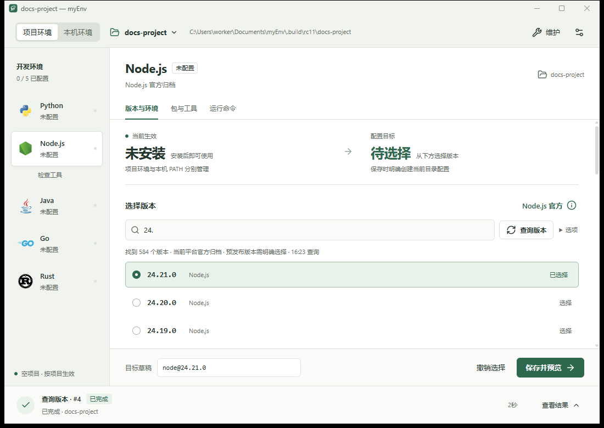

# myEnv Windows 安装与入门

当前为 `0.1.0-rc.11` 本地候选，尚未公开发布。实际可下载制品以 [GitHub Releases](https://github.com/XVSHIFU/myEnv/releases) 为准。Windows amd64 提供 GUI、TUI 与 CLI，制品未签名，性能及部分兼容性验收仍开放。

## 选择便携包或安装向导

| 方式 | 包含内容 | 适合用途 |
| --- | --- | --- |
| `myenv-0.1.0-rc.11-windows-amd64-portable.zip` | GUI、CLI/TUI 和第三方许可 | 用图形界面操作，或把完整目录放在自己的工具位置 |
| `myenv-0.1.0-rc.11-windows-amd64-setup.exe` | CLI/TUI，可加入当前用户 PATH | 在终端直接输入 `myenv`，由安装器管理升级和卸载 |

使用软件无需安装 Go 或 Node。Windows 需要 Windows 10 / Server 2016 或更新版本；安装向导使用系统自带的 .NET Framework 4.x。GUI 另外需要 Microsoft Edge WebView2 Runtime，CLI/TUI 不依赖 WebView2。

校验文件可用 `Get-FileHash <文件路径> -Algorithm SHA256`，与随包提供的 `SHA256SUMS` 比对。摘要用于检查完整性，不是发行者签名。

## 启动便携 GUI

1. 完整解压 ZIP，将目录放在固定位置，例如 `C:\Tools\myEnv`。
2. 保持同版本 `myenv-gui.exe` 和 `myenv.exe` 在同一目录，保留第三方许可文件。
3. 双击 `myenv-gui.exe`。CLI/TUI 也可通过同目录的 `myenv.exe` 启动。

缺少 WebView2 时，当前 GUI 提示通过微软 bootstrapper 联网安装。离线机器需预装微软官方 WebView2 Evergreen Standalone Installer（x64）；便携包没有捆绑离线运行时。无 WebView2 干净机器的完整验收仍开放。

## 首次检查与工作范围

首次打开时，可直接检查本机环境，也可勾选“同时检查一个项目目录”并选择项目文件夹。检查只记录当前版本、路径及包信息，不安装软件、不更改终端默认版本。可以“暂时跳过”，之后从“维护 → 选择检查范围”重新打开。已有记录会保存，后续启动不再反复弹出。

| GUI 范围 | 含义 |
| --- | --- |
| 本机环境 → 本机已安装 | 应用启动 PATH 中的命令及其他已发现安装 |
| 本机环境 → myEnv 工具链 | myEnv 为当前用户准备的独立默认环境，对应 CLI `--global` |
| 项目环境 | 顶部目录选择器中那个项目的声明、环境和运行命令 |

如果终端中的 Node/Python 版本与 GUI 不同，先用 `Get-Command node -All` 或 `Get-Command python -All` 比较完整路径。终端可能使用别名、函数或启动脚本；GUI 不会自动执行这些脚本。修改 PATH 后退出 GUI 再重开，然后刷新检查。

## 选择版本、预览与同步

1. 选择项目目录，或打开本机环境下的“myEnv 工具链”。
2. 选择语言，查询版本并筛选。JDK 1.8 对应 Java 8；来源详情保留完整厂商和版本名。
3. 选中目标后点击“保存并预览”。空项目先确认创建本目录配置；这一步尚未安装。
4. 核对中央变更预览中的范围与目标版本，再确认同步。
5. 完成后查看当前生效版本，或进入“运行命令”。



受管环境准备成功后才切换，失败或取消保留原活动环境。底部任务区常驻，显示状态、阶段与耗时；有下载总量时显示确定进度，否则显示活动状态。日志按需展开，取消后等待收尾并检查最终结果。

## 包与工具管理

选中 Node.js 或 Python 后，语言下方出现已检查的 npm/pnpm 或 uv/pip 快捷入口，小窗口放到页签下方。点击工具名称直接管理，“更多…”进入完整包与工具页。pip 绑定具体 Python 解释器；uv 是 Astral 的独立工具。同名工具有多个位置时，先明确目标位置。

工具全部展示，包列表默认10项。每行右侧“管理”打开抽屉，可安装、更新、切换版本或卸载。在官方目录中，npm 支持关键词搜索，PyPI 需要完整包名。“官方未找到”与网络失败分别提示。

期望可选最新版或指定版本。最新版在预览时解析成具体官方稳定版本，不会后台自动更新。Node 项目的原生声明与安装锁分别保留期望和精确结果；外部 Python 的操作不自动修改 `pyproject.toml` 或 `requirements.txt`。

包列表可搜索、勾选或全选筛选结果，再进入批量抽屉。全选包含折叠的匹配项，同次最多100包，不同位置分开管理。抽屉可逐包调整期望和排除条目，预览后才执行。失败或取消逐项显示结果；已完成的外部包变更不会自动回滚。

GUI 禁用 Node 安装脚本，Python 仅安装 wheel。myEnv 已应用的 Python 环境不能原地改包，请修改原生项目声明后同步。复杂 workspace、未知归属、需要构建的包交给原管理器处理；管理器自身必须单项操作，独立 uv 卸载使用原安装方式。详细步骤见[包与工具管理](https://xvshifu.github.io/myEnv/guide/packages/)。

## 运行命令与返回工作区

在“运行命令”中填写程序名和逐行参数，高级选项支持 JSON 参数数组。确认后打开独立终端；命令结束显示退出码并等待 Enter，输出不会一闪而过。终端接手的命令不随 GUI 关闭而取消。

维护、设置与外部管理页提供返回工作区的入口。“恢复上一次环境”只切换 myEnv 保留的环境代，不恢复声明、项目包、代码或系统 PATH。任务记录用于查看历史，不会重新执行旧操作。

## 安装向导与 PATH

1. 双击 setup，默认目录为 `%LOCALAPPDATA%\Programs\myEnv`。
2. 保持“加入当前用户 PATH”勾选，点击“安装 / 升级”，无需管理员权限。
3. 退出整个终端应用再重开 PowerShell，执行：

```powershell
myenv --version
myenv --help
myenv help manual
```

中文系统默认中文；`myenv --lang en --help` 切换英文。安装器检查 PATH 中的同名程序，冲突时先处理或取消加入 PATH；PowerShell 同名函数/别名还可用 `Get-Command myenv -All` 检查。

便携版可手动把目录加入用户 `Path`，添加目录而不是 exe 文件。加入 `myenv` 的 PATH 不会替换系统 Node/Python；项目命令用 `myenv run ...` 明确选择环境。

## 在终端使用 TUI

```powershell
myenv tui
myenv tui --global
myenv -C C:\path\to\project tui
```

需要真实交互式终端，建议至少80列×24行。上下键选择语言，Enter 查询；`/` 筛选，Enter 选择目标，再明确保存、预览并确认同步。Esc 返回，`m` 打开菜单，`c` 取消，`q` 或 Ctrl-C 退出；按键以当前页面提示为准。

运行命令可逐个编辑参数，完整确认后临时把终端交给程序，结束后返回界面显示退出码。TUI 不新增 GUI 的包抽屉或包管理命令。原生 Linux 可用 CLI/TUI；Linux GUI 暂缓，WSL TUI 门禁仍在。完整说明见[TUI 终端界面](https://xvshifu.github.io/myEnv/guide/tui/)。

## CLI 的第一个项目

在项目目录创建 `.node-version`，内容为 `22`，随后执行：

```powershell
myenv init
myenv sync
myenv run node --version
```

Python 项目改为 `.python-version`，内容 `3.12`，运行 `myenv run python --version`。首次同步需联网，已有 `myenv.yaml` 时从 `sync` 开始。`run` 不隐式安装。

## 升级、卸载与构建

升级 setup 时沿用原目录，先退出运行中的 myEnv。更换目录前先卸载旧安装；安装器不覆盖缺少安装记录或内容已被修改的文件。Windows“已安装的应用”中卸载只移除登记的程序及本安装器添加的 PATH，保留项目、环境和缓存。便携版删除自己放置的程序文件，撤销自己加入的 PATH；环境数据不是程序卸载的一部分。

源码构建与打包见[构建说明](build.md)。当前安装包未签名，高 DPI、真实 IME、无 WebView2 干净机器、管理器自身真实写操作等仍有验收缺口；状态见[当前记录](implementation.md)。
